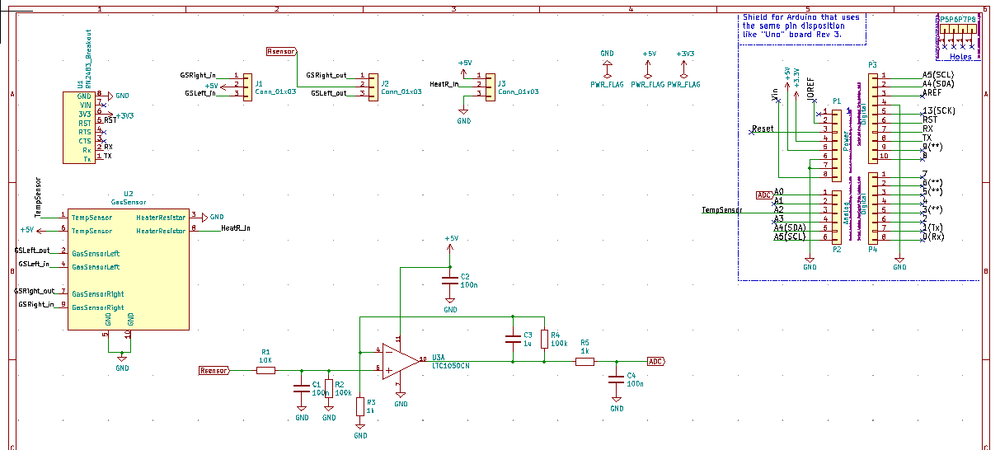
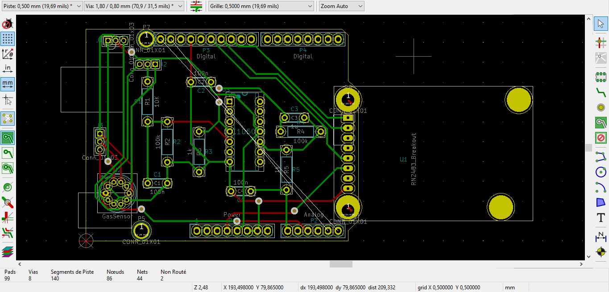

# 2020_2021_Xu_Zennaro

MOSH-KiCAD Project

# TASKS

- [x] MOSH
- [x] KiCAD

---

### KiCad - Shield for Arduino

- [x] Créer un projet de PCB pour réaliser une shield Arduino
- [x] Saisi du schéma
- [x] Vérification des tests électriques **ERC**
- [x] Association des empreintes de composants avec leur boitier
- [ ] Combiner les modèles 3D aux empreintes
- [x] Génération de la netlist
- [x] Placement des composants
- [x] Router les pistes de la carte électronique

#### KiCad Tools used

[KiCad EDA - Schematic Capture & PCB Design Software](https://kicad-pcb.org/), version: 5.1.8

Open source EDA / electronics CAD software for Windows, macOS and Linux.

#### Librairies de composants

* LTC1050:
* Resistor_THT:R_Axial_DIN0207_L6.3mm_D2.5mm_P10.16mm_Horizontal
* Capa
* Arduino Uno
* Conn_01x03:Pin

#### Electrical diagram

## Component placement

## Routage

